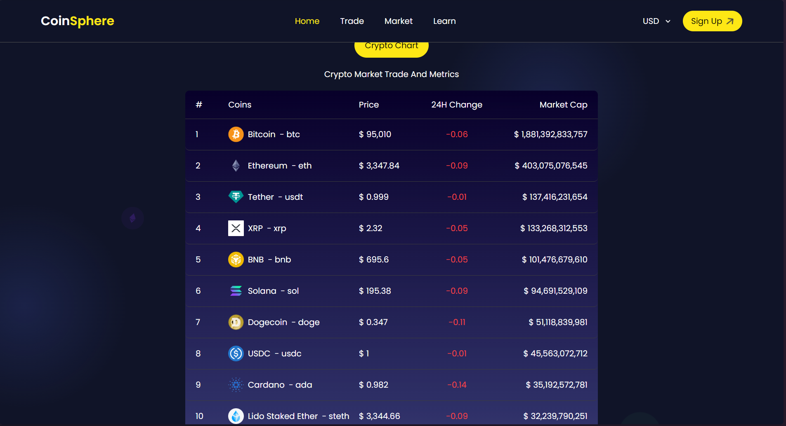
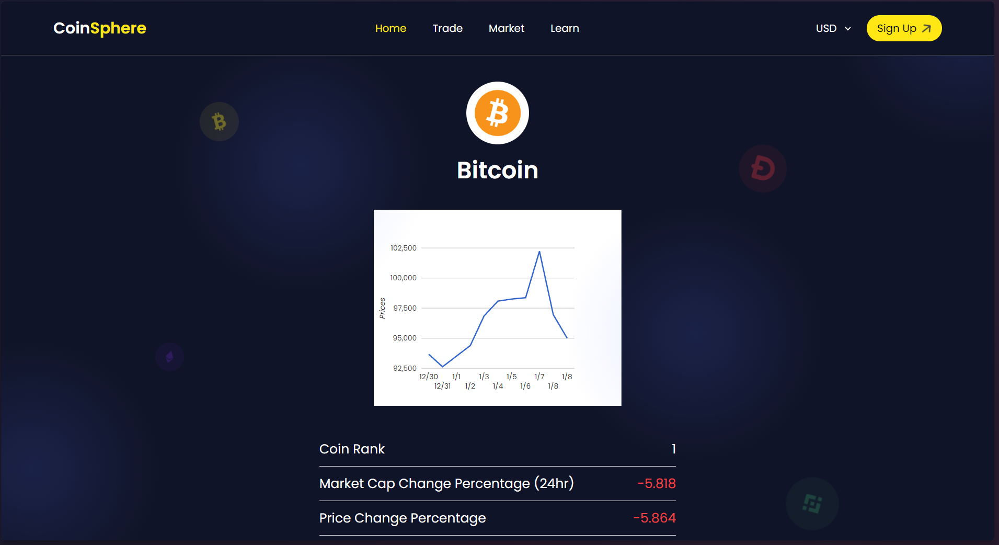

# CoinSphere - Cryptocurrency Market Tracker

CoinSphere is a cryptocurrency tracking web application that provides users with real-time insights into the crypto market. Built using React and styled with Tailwind CSS, it fetches live market data using the CoinGecko API. With features like a search bar, market charts, and detailed analytics for each cryptocurrency, CoinSphere empowers users to make informed decisions in their crypto journey.


## Features
- **Search Functionality**: Quickly find details about any cryptocurrency by searching its name or symbol.
- **Real-Time Data**: Get updated prices, market caps, and 24-hour changes for popular cryptocurrencies.
- **Dynamic Charts**: View historical price trends and percentage changes for individual coins.
- **Clean UI/UX**: A modern, responsive design implemented with Tailwind CSS for an intuitive user experience.

## Tech Stack
- **Frontend**: React.js
- **Styling**: Tailwind CSS
- **API Integration**: CoinGecko API

## Installation
1. Clone the repository:
   ```bash
   git clone https://github.com/dhruv1086k/Coinsphere.git
   ```
2. Navigate to the project directory:
    ```bash
    cd coinsphere
    ```
3. Install dependencies:
    ```bash
    npm install
    ```
4. Start the development server:
    ```bash
    npm run dev
    ```

5. Open the application in your browser at shown address.

## How It Works
- **Homepage**: The landing page features a search bar and a table displaying the top 10 cryptocurrencies with their prices, 24-hour changes, and market caps.

- **Search**: Users can enter a cryptocurrency name or symbol to fetch specific details.

- **Coin Details**: Clicking on a cryptocurrency displays a detailed page with its historical price chart and key metrics like market cap change and price change percentage.

## API Reference
 #### Base URL: https://api.coingecko.com/api/v3/coins/
 #### Endpoints used:
- /markets for market data
- /{id}/market_chart for historical data

## Screenshots
**Homepage**

**Cryptocurrency Table**

**Coin Details**



## Future Enhancements

- Add user authentication for personalized watchlists.

- Include a "Learn" section for cryptocurrency basics.

- Support for more fiat currencies and language options.

- Integrate with trading platforms for portfolio tracking.